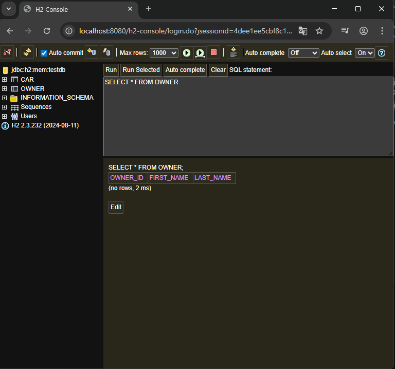

# SpringBoot의 간단 설명

## 간단 복습

Entity의 개념 <Br>
JPA가 그래서 Entity와 어떻게 연결되어 있고, inmemory database인 h2와 어떻게 연결이 되는지 여부도 수업 <br>
build.gradle / application.properties라고 하는 파일들에 명령어들을 작성하게 됐습니다.

Entity 클래스의 경우에는 DB에서의 table 역할을 함.
Entity 클래스의 field들은 column 역할을 함.
JPA와 연동 되어있기 때문에 필수적으로 기본 생성자를 요구함.
id값을 AUTO로 잡아놨기 때문에(즉, 생성될 때마다 db에서 고유 id값을 부여하기 때문에)
@AllargsConstructor를 적용하면 오류가 발생합니다.

Lombok이 적용되지 않았을 때 Entity class 구조

```java
package com.example.cardatabase.domain;

import jakarta.persistence.Entity;
import jakarta.persistence.GeneratedValue;
import jakarta.persistence.GenerationType;
import jakarta.persistence.Id;

@Entity         // 테이블을 만들기 위한 것

public class Owner {
    @Id
    @GeneratedValue(strategy = GenerationType.AUTO)
    private Long ownerId;

    private String firstName, lastName;

    public Owner(){};

    public Owner(String firstName, String lastName) {
        this.firstName = firstName;
        this.lastName = lastName;
    }

    public Long getOwnerId() {
        return ownerId;
    }

    public void setOwnerId(Long ownerId) {
        this.ownerId = ownerId;
    }

    public String getFirstName() {
        return firstName;
    }

    public void setFirstName(String firstName) {
        this.firstName = firstName;
    }

    public String getLastName() {
        return lastName;
    }

    public void setLastName(String lastName) {
        this.lastName = lastName;
    }
}

```

Lombok 이 적용된 Entity Class의 구조

```java
package com.example.cardatabase.domain;

import jakarta.persistence.Entity;
import jakarta.persistence.GeneratedValue;
import jakarta.persistence.GenerationType;
import jakarta.persistence.Id;
import lombok.*;

@Entity         // 테이블을 만들기 위한 것
@Getter
@Setter
@ToString
@NoArgsConstructor(force = true)
@RequiredArgsConstructor

public class Owner {
    @Id
    @GeneratedValue(strategy = GenerationType.AUTO)
    private Long ownerId;

    private final String firstName;
    private final String lastName;
}

```

- `@NoArgsConstructor(force = true)` : final 필드가 있는 경우에도 해당 필드를 null로 초기화 하는 생성자를 강제로 생성해주기 때문에 `final` 키워드가 붙은 경우에도 JPA에서 요구되는 기본 생성자를 만들 수 있고, `@RequiredArgsConstructor`와도 충돌하지 않습니다.

http://localhost:8080/h2-console


domain 패키지에 Owner이란느 엔티티 클래스와 OwnerRespository라는 repository 인터페이스를 만들어야 합니다. 그리고 OwnerRepository는 JpaRepository를 상속 받아야 합니다.

이상의 일대다 관계를 추가하려면 `@ManyToOne`과 `@OneToMany` 애너테이션(jakarta.persistence)을 이용해야 합니다. 외래 키를 포함한 Car 엔티티 클래스에서는 `@ManyToOne`을 사용할겁니다.(이것 때문에 위에 부분 복사해왔습니다.) 그리고 외래키를 추가했기 때문에 field 구성이 달라져야겠죠.

그럼 DB 적으로 봤을 때는 car table에다가 외래키인 ownerId를 추가하는 개념이라고 볼 수 있기 때문에 Car entity class에는 Owner 관련 field를 추가해야 합니다. 그렇다면 새로 추가된 field에 대한 getter / setter도 요구될겁니다. 모든 JOIN 관계에서는 FetchType.LAZY를 이용하는 것이 좋습니다. 대다(toMany) 관계의 경우에는 FetchType.LAZY가 기본 값이므로 정의 할 필요가 없지만 대일(toOne) 관계의 경우에는 반드시 명시해줘야 합니다.

FetchType : DB에서 데이터를 검색하는 전략을 정의. 속성 값으로는
EAGER : 즉시 검색
LAZY : 지연 검색
저희 예제에서는 지연 검색(LAZY)은 DB에서 소유자를 검색하면 필요할 때 해당 소유자와 연관된 모든 자동차를 검색한다는 의미입니다. 반면 즉시 검색(EAGER)은 해당 소유자의 모든 자동차를 즉시 검색합니다.

```java
// Car.java
package com.example.cardatabase.domain;

import jakarta.persistence.*;
import lombok.Data;
import lombok.AllArgsConstructor;
import lombok.NoArgsConstructor;
import lombok.ToString;


@Entity
@Data
@NoArgsConstructor
public class Car {
    @Id
    @GeneratedValue(strategy = GenerationType.AUTO)
    private Long id;
    private String brand, model, color, registrationNumber;
    private int modelYear, price;

    @ManyToOne(fetch = FetchType.LAZY)
    @JoinColumn(name = "owner")
    private Owner owner;

    public Owner getOwner() {
        return owner;
    }

    public void setOwner(Owner owner) {
        this.owner = owner;
    }

    public Car(String brand, String model, String color, String registrationNumber, int modelYear, int price) {
        this.brand = brand;
        this.model = model;
        this.color = color;
        this.registrationNumber = registrationNumber;
        this.modelYear = modelYear;
        this.price = price;
    }
}
```

```java
Owner.java
package com.example.cardatabase.domain;

import jakarta.persistence.*;
import lombok.*;

import java.util.List;

@Entity         // 테이블을 만들기 위한 것
@Getter
@Setter
@ToString
@NoArgsConstructor(force = true)
@RequiredArgsConstructor

public class Owner {
    @Id
    @GeneratedValue(strategy = GenerationType.AUTO)
    private Long ownerId;

    @NonNull
    private final String firstName;
    @NonNull
    private final String lastName;

    // 소유자는 다수의 차들을 가질 수 있기 때문에 collections를 사용(list)
    @OneToMany(cascade = CascadeType.ALL, mappedBy = "owner")
    private List<Car> cars;
}

```

이상의 코드에서 `@Data`를 달아둔 경우에 일부러 겹치지만 Owner와 관련된 getter / setter를 코드로 써두었습니다. 반면에 `@Getter , @Setter`를 명시해둔 Owner 클래스에는 cars 관련 getter / setter를 안썼습니다. 당연히 프로젝트 하실 때는 setOwner / getOwner를 코드로 쓰실 필요가 없습니다.

Owner class의 `@OneToMany` 애너테이션에는 특성이 있습니다.

1. cascade 속성은 삭제 / 업데이트 시 연속 효과가 적용되는 방법을 지정합니다.

- ALL로 설정하게 되면 모든 작업이 연속적으로 적용됩니다.
- 예를 들어 Owner를 삭제하게 되면 그 소유자와 연결된 Car 객체들도 전부 다 삭제됩니다.

2. mappedBy="owner" 속성 설정 : Car 클래스 사이에 이 관계의 외래 키인 owner 필드가 존재함을 명시함.

SQL을 배운 저희가 좀 어색하게 느낄 수 있는 것은 ownerId 필드 하나만 가지고 와서 연결짓는게 아니라 Owner 클래스를 통째로 들고와서 Car에 field로 삼는다는 점입니다.

## H2 → MariaDB로 이식

H2 version을 push합니다

git add .
git commit -m "feat: H2 인메모리 설정 관련 코드"
git push
