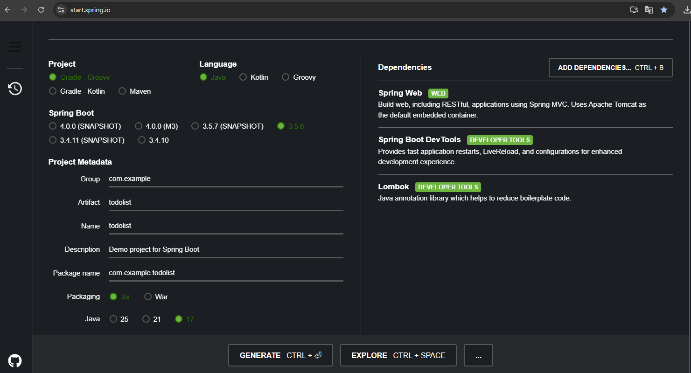

[start.spring.io](https://start.spring.io/)

# 금일 수업 계획
  1. 이하의 요구 사항 명세서를 기준으로 todo list 스프링부트 프로젝트를 작성하시오.
  2. 막히면 1000hours 완성하시오.
  3. 어제 명단 넘겨받았는데 이력서 / 자소서 쓰셔야 하는 분들 완성해서 카페 업로드까지 완료하시오.

# Todo-list 작성

## 📝 TodoList 스프링 부트 프로젝트 상세 요구사항 명세서

### 🏛️ 1. 공통 요구사항

#### **1.1. 프로젝트 기본 설정**

  - **프로젝트**: Gradle - Groovy
  - **언어**: Java
  - **Spring Boot 버전**: 3.5.6
  - **Group**: `com.example`
  - **Artifact**: `todolist`
  - **Packaging**: Jar
  - **Java 버전**: 17

#### **1.2. 필수 의존성 (`build.gradle`)**

  - **Spring Web**: RESTful API 컨트롤러 생성.
  - **Spring Data JPA**: 데이터베이스 연동 및 ORM.
  - **Spring Boot DevTools**: 개발 편의성을 위한 자동 재시작.
  - **Lombok**: Getter, Setter, 생성자 등 상용구 코드 자동 생성.
  - **MariaDB Driver**: MariaDB 데이터베이스 연결.
  - **Spring Security**: 인증 및 인가 기능 구현.
  - **Java JWT (jjwt)**: JWT 토큰 생성 및 검증 (API, Impl, Jackson 3개 라이브러리).

#### **1.3. 데이터베이스 및 애플리케이션 설정 (`application.properties`)**

  - **데이터베이스**: MariaDB 연결 정보 (URL, username, password) 설정.
  - **JPA**: DDL 자동 생성 전략을 `create-drop`으로 설정하여 개발 중 스키마를 유연하게 관리.
  - **서버 포트**: `8080` (기본값).

-----

### 🧬 2. 엔티티 상세 가이드 (`domain` 패키지)

#### **2.1. `AppUser` Entity**

사용자 계정 정보를 저장하는 테이블입니다.

  - **`id` (Long)**
      - **역할**: 사용자의 고유 식별자 (Primary Key).
      - **설정**: `@Id`, `@GeneratedValue(strategy = GenerationType.AUTO)`
  - **`username` (String)**
      - **역할**: 로그인 시 사용될 아이디. 중복될 수 없습니다.
      - **설정**: `@Column(nullable = false, unique = true)`
  - **`password` (String)**
      - **역할**: 암호화되어 저장될 비밀번호.
      - **설정**: `@Column(nullable = false)`
  - **`role` (String)**
      - **역할**: 사용자의 권한 (예: "USER", "ADMIN").
      - **설정**: `@Column(nullable = false)`
  - **`todos` (List\<Todo\>)**
      - **역할**: 해당 사용자가 작성한 모든 할 일 목록.
      - **설정**: `@OneToMany` 연관 관계. 사용자가 삭제되면 해당 사용자의 할 일도 모두 삭제되도록 `cascade = CascadeType.ALL` 설정.

#### **2.2. `Todo` Entity**

개별 할 일 항목을 저장하는 테이블입니다.

  - **`id` (Long)**
      - **역할**: 할 일의 고유 식별자 (Primary Key).
      - **설정**: `@Id`, `@GeneratedValue(strategy = GenerationType.AUTO)`
  - **`content` (String)**
      - **역할**: 할 일의 내용.
      - **설정**: `@Column(nullable = false)`
  - **`isCompleted` (boolean)**
      - **역할**: 할 일의 완료 여부 (true: 완료, false: 미완료).
      - **설정**: 기본값은 `false`가 되도록 서비스 로직에서 처리합니다.
  - **`user` (User)**
      - **역할**: 이 할 일을 소유한 사용자 (Foreign Key).
      - **설정**: `@ManyToOne(fetch = FetchType.LAZY)`

-----

### 🧱 3. API 및 비즈니스 로직 명세

#### **3.1. `TodoService` 추가 로직 예시 (`service` 패키지)**

기본적인 CRUD 외에 다음과 같은 비즈니스 로직을 구현해야 합니다.

  - **`updateTodoStatus(Long id)`**: 특정 `id`의 할 일 완료 상태를 변경(toggle)합니다.

      - **로직**: `id`로 `Todo` 항목을 찾습니다. `isCompleted` 값을 현재 상태의 반대(`!isCompleted`)로 변경하고 저장합니다.
      - **예시**: `false` 였으면 `true`로, `true` 였으면 `false`로 변경됩니다.

  - **`clearCompletedTodos()`**: 현재 로그인된 사용자의 완료된(`isCompleted = true`) 모든 할 일을 삭제합니다.

      - **로직**: 현재 인증된 사용자의 `id`를 가져옵니다. 해당 사용자의 `Todo` 목록 중 `isCompleted`가 `true`인 항목들을 모두 찾아서 한 번에 삭제합니다.

#### **3.2. `TodoController` API 명세 (`web` 패키지)**

  - `PATCH /api/todos/{id}`: 특정 할 일의 **완료 상태만** 변경합니다.

      - **요청**: Body 없이 ID만으로 요청합니다.
      - **응답**: 상태가 변경된 `Todo` 객체와 200 OK.

  - `DELETE /api/todos/completed`\*\*: 완료된 모든 할 일을 삭제합니다.

      - **요청**: Body 없이 요청합니다.
      - **응답**: 성공 시 204 No Content.

-----

### 🛠️ 4. DTO 및 Record 명세

#### **4.1. 버전 1: DTO 클래스 사용 (`dto` 패키지)**

  - **`AccountCredentialsDto` Class**:
      - **필드**: `username` (String), `password` (String)
      - **용도**: 로그인 요청 시 사용자의 아이디와 비밀번호를 전달합니다.
  - **`TodoRequestDto` Class**:
      - **필드**: `content` (String)
      - **용도**: 새로운 할 일을 생성할 때 `content`만 전달받습니다. (`isCompleted`는 기본 `false`로 처리)
  - **`TodoUpdateDto` Class**:
      - **필드**: `content` (String)
      - **용도**: 할 일의 내용을 수정할 때 사용합니다.

#### **4.2. 버전 2: Record 사용 (`dto` 패키지)**

  - **`AccountCredentialsRecord` Record**:
      - `public record AccountCredentialsRecord(String username, String password) {}`
  - **`TodoRequestRecord` Record**:
      - `public record TodoRequestRecord(String content) {}`
  - **`TodoUpdateRecord` Record**:
      - `public record TodoUpdateRecord(String content) {}`

-----

### 🚀 5. TodoList 프로젝트 작성 순서 가이드라인

1.  **프로젝트 생성 및 의존성 설정**: Spring Initializr로 프로젝트를 생성하고, `build.gradle`에 명시된 모든 의존성을 추가한 후 Gradle을 새로고침합니다.

2.  **`application.properties` 설정**: MariaDB 연결 정보 및 JPA 설정을 완료합니다.

3.  **엔티티 및 리포지토리 구현**:

      - `domain` 패키지에 `User`, `Todo` 엔티티를 **필드 가이드**에 맞게 작성합니다.
      - `UserRepository`, `TodoRepository` 인터페이스를 생성하고 `JpaRepository`를 상속받게 합니다.

4.  **DTO 또는 Record 정의**:

      - `dto` 패키지를 만들고, 선택한 버전(DTO 또는 Record)에 맞춰 `AccountCredentials`, `TodoRequest`, `TodoUpdate` 객체를 정의합니다.

5.  **보안 및 JWT 설정**:

      - `service` 패키지에 `UserDetailsServiceImpl`과 `JwtService`를 구현합니다.
      - 루트 패키지에 `AuthEntryPoint`, `AuthenticationFilter`, `SecurityConfig`를 순서대로 작성하여 보안 체계를 완성합니다.

6.  **서비스 로직 구현**:

      - `service` 패키지에 `TodoService`를 생성합니다.
      - 기본 CRUD 기능과 함께, **추가 로직 예시**에 명시된 `updateTodoStatus`, `clearCompletedTodos` 메서드를 구현합니다.

7.  **컨트롤러(API) 구현**:

      - `web` 패키지에 `LoginController`와 `TodoController`를 작성합니다.
      - `TodoController`에는 기본 CRUD API와 함께 `PATCH /api/todos/{id}`, `DELETE /api/todos/completed` 엔드포인트를 추가로 구현합니다.

8.  **초기 데이터 삽입 및 테스트**:

      - 메인 클래스에 `CommandLineRunner`를 구현하여 테스트용 `User`와 `Todo` 데이터를 추가합니다. (비밀번호는 반드시 `PasswordEncoder`로 암호화)
      - **Postman**을 사용하여 모든 API 엔드포인트가 의도대로 동작하는지 테스트합니다. 특히 할 일 완료 상태 변경과 완료된 항목 일괄 삭제 기능이 잘 작동하는지 확인합니다.

TodoList 프로젝트 구조 🌳
제공된 요구사항 명세서를 바탕으로 todolist 스프링 부트 프로젝트의 전체 구조를 출력하면 다음과 같습니다. 이 구조는 MVC 패턴과 관심사 분리 원칙에 따라 패키지를 명확하게 나눈 표준적인 형태입니다.

각 패키지의 역할
config: SecurityConfig와 같이 애플리케이션의 전반적인 설정을 담당하는 클래스들을配置합니다.

domain: 데이터베이스 테이블과 직접 매핑되는 Entity 클래스와, 해당 엔티티에 대한 데이터베이스 작업을 추상화한 Repository 인터페이스를 포함합니다.

dto (또는 record): 계층 간 데이터 전송을 위해 사용되는 객체입니다. API 요청 및 응답 본문을 이 객체로 변환하여 사용합니다.

filter: HTTP 요청이 컨트롤러에 도달하기 전에 특정 로직(인증 등)을 수행하는 필터를配置합니다.

handler: 인증 실패와 같은 특정 예외 상황을 처리하는 클래스를 포함합니다.

service: 핵심 비즈니스 로직을 구현하는 계층입니다. 컨트롤러의 요청을 받아 실제 작업을 처리합니다.

web: 클라이언트의 HTTP 요청을 직접 받는 Controller 클래스들을 포함하며, API 엔드포인트를 정의합니다.